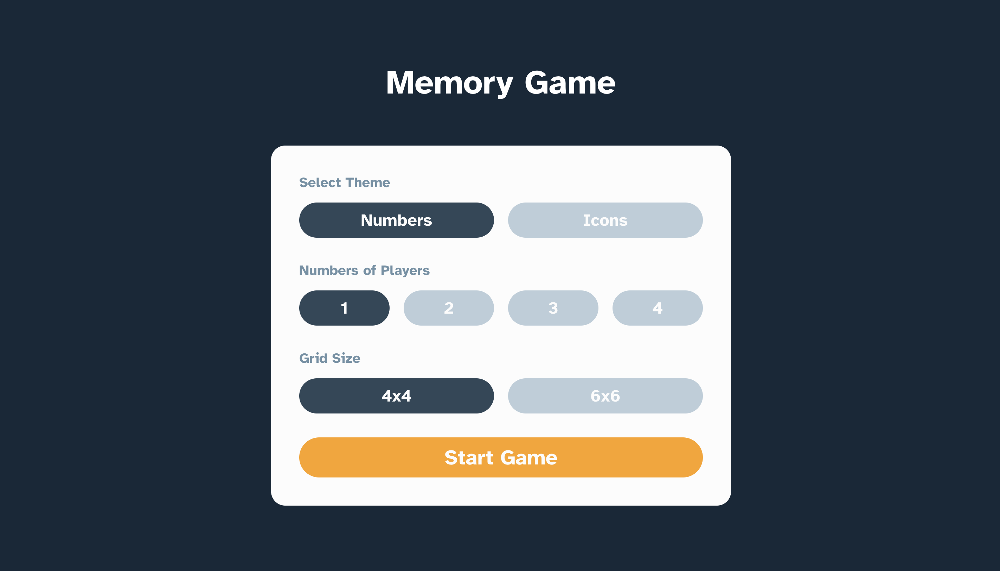
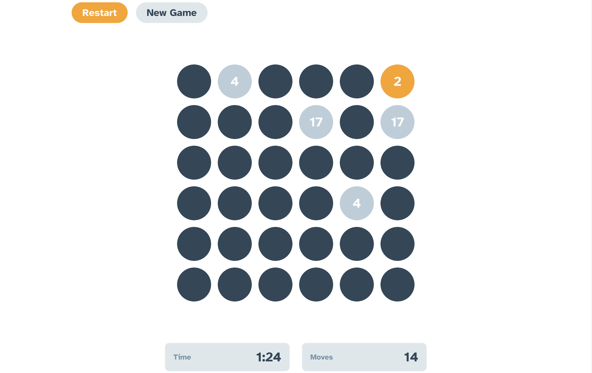

# Memory Game 🧠

An entertaining Memory Game featuring two playful puzzles – numbers and icons. Enjoy this amusing game with 1 to 4 players, featuring both 4x4 and 6x6 grid challenges. Match hidden icons or numbers to win the game. Try it out now and test your memory skills!

Click [here](https://memory-game-rajeev.vercel.app/) and Enjoy the Memory game.

  
  

## Features and Interfaces

1. Home page

   - Player can select the type of game between Icon and Number.
   - Player can select the number of players.
   - Single user can play game with computer logic.
   - 4x4 and 6x6 grid challenges to make game more entertaining.

2. Game Page

   - A grid of cards with hidden icons or numbers.
   - A timer to show the time taken by the user to complete the game.
   - A counter to show the total moves taken by the user to complete the game.
   - A button to go back to home page.

   - A button to restart the game.

   - 

3. Winner Page

   - A Greet message to the winner.
   - Time taken by the user to complete the game.
   - Total moves taken by the user to complete the game.
   - A button to play again.
   - A button to go back to home page.

   - 

## Tech stack

#### Frontend

- React.Js
- JavaScript
- React-DOM
- User Events
- Redux

#### Other Tools

- Font Awesome/react-fontawesome
- Fort Awesome/free-solid-svg-icons

## Points to remember while testing the WebApp

1. First of all fork this [repository](https://github.com/Rajeevjewar/Memory-Game.git) and clone it.
2. Install all the dependencies using `npm install` command.
3. Run the app using `npm start` command.
4. When testing on android emulator, if you get a connection error use `http://localhost:3000/`
5. The app is now running, Now you can test the WebApp.

## Instructions

1. Select the type of game between Icon and Number.
2. Select the number of players.
3. Select the grid size between 4x4 or 6x6.
4. Click on the start button.
5. Click on the cards to reveal the hidden icons or numbers.
6. Match the cards to win the game.
7. Click on the restart button to restart the game.
8. Click on the home button to go back to home page.

## Useful Links

- [Project Demo](https://memory-game-rajeev.vercel.app/) for Web version

- [Project Repository](https://github.com/Rajeevjewar/Memory-Game.git)

## Need help?

Feel free to contact me on [Twitter](https://twitter.com/be_rajeevkumar) or [LinkedIn](https://www.linkedin.com/in/berajeevkumar/), know more about me at [iamrajeev.me](https://iamrajeev.me)

<h1 align=center>Happy Coding 👨‍💻</h1>

Show some ❤️&nbsp; by giving the star to this repo
